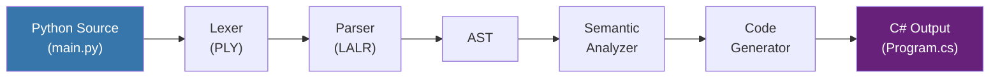
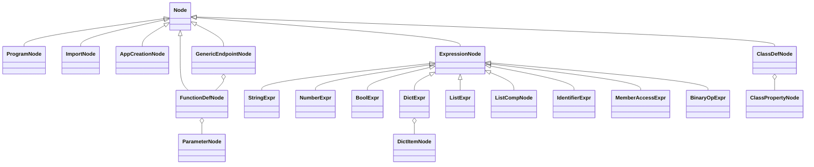
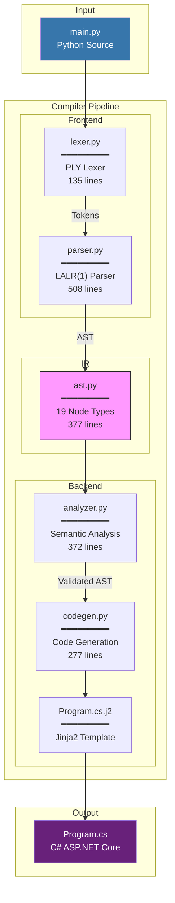

# Dukpyra Compiler Architecture

> **Python-to-C# Transpiler for Web APIs**

---

## Overview

Dukpyra implements a **5-stage compiler pipeline** that transforms Python web API definitions into executable C# ASP.NET Core Minimal API code.



---

## Component Details

### Stage 1: Lexer (`lexer.py`)

| Property | Value |
|----------|-------|
| **Lines** | 135 |
| **Library** | PLY (Python Lex-Yacc) |
| **Function** | Tokenizes source code into tokens |

**Token Categories:**
- **Keywords:** `import`, `def`, `class`, `return`, `for`, `in`, `if`
- **HTTP Methods:** `get`, `post`, `put`, `delete`, `patch`
- **Type Hints:** `int`, `str`, `float`, `bool`
- **Literals:** `True`, `False`, `None`, `NUMBER`, `STRING`
- **Operators:** `=`, `==`, `!=`, `<`, `>`, `<=`, `>=`

```python
# Input
@app.get("/users/{id}")

# Lexer Output
[AT, ID("app"), DOT, GET, LPAREN, STRING("/users/{id}"), RPAREN, NEWLINE]
```

---

### Stage 2: Parser (`parser.py`)

| Property | Value |
|----------|-------|
| **Lines** | 508 |
| **Algorithm** | LALR(1) |
| **Grammar Rules** | 76 productions |

**Grammar Structure:**

```
program         → preamble class_definitions endpoints
preamble        → import_stmt app_creation
class_definition → CLASS ID COLON NEWLINE properties
endpoint        → decorator function_def
decorator       → AT ID DOT METHOD LPAREN STRING RPAREN
function_def    → DEF ID LPAREN params RPAREN COLON NEWLINE RETURN expr
```

---

### Stage 3: AST (`ast.py`)

| Property | Value |
|----------|-------|
| **Lines** | 377 |
| **Node Types** | 19 dataclasses |
| **Pattern** | Composite Pattern |

**AST Hierarchy:**



**Key Nodes:**

| Node | Purpose |
|------|---------|
| `ProgramNode` | Root node containing all definitions |
| `GenericEndpointNode` | Platform-agnostic endpoint (method + path + handler) |
| `ClassDefNode` | Request/Response body class |
| `ListCompNode` | List comprehension for LINQ generation |

---

### Stage 4: Semantic Analyzer (`analyzer.py`)

| Property | Value |
|----------|-------|
| **Lines** | 372 |
| **Error Types** | 7 |
| **Pattern** | Visitor Pattern |

**Validation Rules:**

| Code | Error Type | Example |
|------|------------|---------|
| E001 | Duplicate class definition | `class User` defined twice |
| E002 | Duplicate endpoint | Same `GET /users` twice |
| E003 | Duplicate property in class | `name: str` appears twice |
| E004 | Unknown type in class property | `age: xyz` |
| E010 | Path parameter not in function | `/users/{id}` but no `id` param |
| E011 | Unknown type in parameter | `def get(x: unknown)` |
| E020 | Undefined variable reference | Using `x` not in scope |

**Symbol Table:**
```python
@dataclass
class SymbolTable:
    classes: Dict[str, ClassDefNode]      # class_name → node
    endpoints: Dict[str, EndpointNode]    # "GET /path" → node
    builtin_types: Set[str]               # {"int", "str", "float", "bool", "list", "dict"}
```

---

### Stage 5: Code Generator (`codegen.py`)

| Property | Value |
|----------|-------|
| **Lines** | 277 |
| **Template Engine** | Jinja2 |
| **Pattern** | Visitor Pattern |

**Type Mapping:**

| Python | C# |
|--------|-----|
| `str` | `string` |
| `int` | `int` |
| `float` | `double` |
| `bool` | `bool` |
| `None` | `null` |
| `True`/`False` | `true`/`false` |
| `list` | `new[] {...}` |
| `dict` | `new {...}` |
| Custom class | `public record` |

**LINQ Transformation:**
```python
# Python (List Comprehension)
[u.name for u in users if u.active]

# C# (LINQ)
users.Where(u => u.active).Select(u => u.name).ToList()
```

**Template (`Program.cs.j2`):**
```csharp
var builder = WebApplication.CreateBuilder(args);
var app = builder.Build();


{{ class_record }}



app.Map{{ endpoint.method }}("{{ endpoint.path }}", ({{ endpoint.params }}) =>
{
    {{ endpoint.body }}
});


app.Run();
```

---

## Data Flow Example

**Input (`main.py`):**
```python
import dukpyra
app = dukpyra.app()

class CreateUser:
    name: str
    age: int

@app.post("/users")
def create_user(body: CreateUser):
    return {"created": True, "name": body.name}
```

**Output (`Program.cs`):**
```csharp
var builder = WebApplication.CreateBuilder(args);
var app = builder.Build();

public record CreateUser(string Name, int Age);

app.MapPost("/users", (CreateUser body) =>
{
    return new { created = true, name = body.Name };
});

app.Run();
```

---

## File Statistics

| File | Lines | Responsibility |
|------|-------|----------------|
| `lexer.py` | 135 | Tokenization |
| `parser.py` | 508 | Grammar parsing |
| `ast.py` | 377 | Node definitions |
| `analyzer.py` | 372 | Semantic validation |
| `codegen.py` | 277 | C# generation |
| `cli.py` | ~400 | CLI interface |
| **Total** | **~2,100** | |

---

## Research Techniques Applied

| Technique | Reference | Implementation |
|-----------|-----------|----------------|
| Rule-driven AST rewriting | [1] | Parser + CodeGen |
| Templates + Transformation synergy | [5] | Jinja2 templates |
| Runtime Type Collection | [6] | Type hints → C# types |
| User-guided "Last Mile" | [4] | Raw C# injection |
| High-Level IR Optimization | [7] | List Comp → LINQ |

---

## Architecture Diagram (Full)


